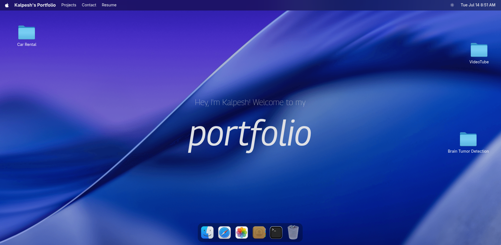
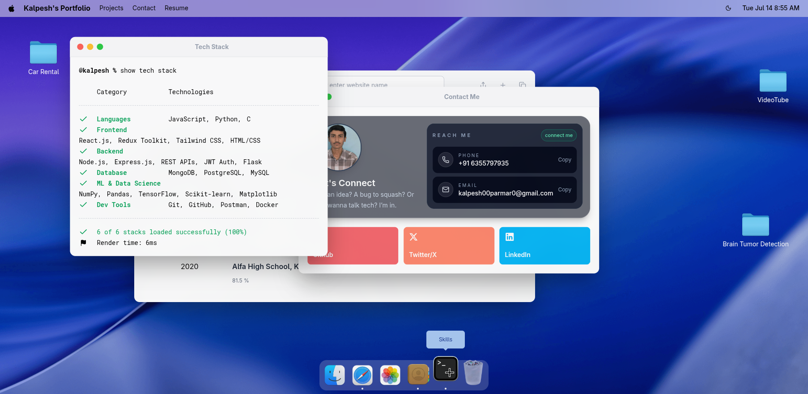
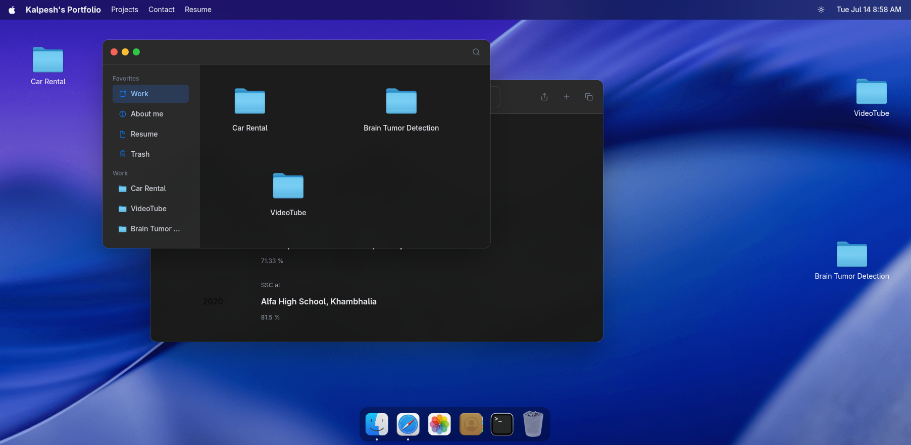
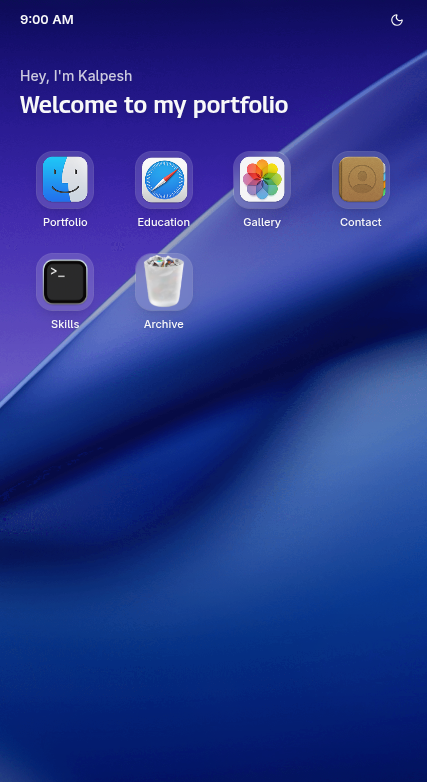

<div align="center">

# Kalpesh's Portfolio

A fully interactive, drag-and-drop, window-managed desktop environment built from scratch with React and GSAP — not a template, not a theme. Every window drags, resizes, minimizes and maximizes for real, with a working Dock, Finder, Terminal, dark mode and a native-feeling mobile experience.

**[Live Demo](https://portfolio-gamma-two-88.vercel.app) · [Report a Bug](https://github.com/Kalpesh-Parmar-0/Portfolio/issues) · [Full Stack Resume](public/files/resume-full.pdf) · [ML & Data Science Resume](public/files/resume-ml.pdf)**


</div>

---

## Preview

|                        Desktop                        | Multitasking                      |
|:---------------------------------------------------: | :----------------------------------------------------: |
|  |  |

|                Dark Mode                | Mobile                            |
| :-------------------------------------: |:----------------------------------------------------------: |
|  |  |

## ✨ Features

### Window management

- **Drag** any window by its title bar (GSAP Draggable, restricted to the header — not the whole window)
- **Resize** from the right edge or bottom edge, with min/max bounds
- **Minimize** with a genie-style animation that flies the window down into its Dock icon
- **Maximize** to fullscreen and back, correctly preserving a manually-resized size across the round trip
- **Focus & stacking** — clicking a window brings it to front with proper z-index management

### A Dock that behaves like a Dock

- Magnification-on-hover, running-app indicator dots, tooltips
- Click to open, click again to close, click a minimized app to restore it
- Always floats above every window, exactly like real macOS

### Real apps, not placeholders

| App          | What it does                                                                                                                           |
| ------------ | -------------------------------------------------------------------------------------------------------------------------------------- |
| **Finder**   | Browse "Work" and "About" locations, open real project folders and file previews                                                       |
| **Terminal** | Renders the tech stack as CLI-style output and categorized                                                                             |
| **Safari**   | Education timeline with Institute name, marks and passing year                                                                         |
| **Photos**   | Gallery with a scrollable album sidebar                                                                                                |
| **Contact**  | Glass-card contact info with direct copy-to-clipboard and social links                                                                 |
| **Resume**   | Tabbed dual-resume viewer (Full Stack / ML & Data Science) rendering live PDFs via `react-pdf`, multi-page support, one-click download |

### Dark mode done properly

- Follows the OS `prefers-color-scheme` by default, live — switches automatically if your system theme changes
- One click overrides it and persists the choice
- Every window, the Dock, the navbar, and the mobile springboard are fully re-themed, not just inverted

### A real mobile experience

- iOS-style springboard: status bar, greeting, glassy app grid, home indicator
- Apps open fullscreen with an iOS-style slide-up transition and a native-feeling back button
- Dark mode, resume tabs and Finder/Photos content all reflow properly at phone width

### The details

- An Apple-style boot animation (logo + progress bar) plays once per load before the desktop reveals
- `prefers-reduced-motion` is respected — the boot screen and other animations back off for people who've asked for less motion

## 🛠 Tech Stack

| Layer             | Tools                                                         |
| ----------------- | ------------------------------------------------------------- |
| **Framework**     | React 19, Vite                                                |
| **Styling**       | Tailwind CSS v4 (class-based dark mode via `@custom-variant`) |
| **Animation**     | GSAP + `@gsap/react`, GSAP Draggable                          |
| **State**         | Zustand (with Immer middleware)                               |
| **PDF rendering** | `react-pdf` / `pdf.js`                                        |
| **Icons**         | `lucide-react`                                                |
| **Utilities**     | `dayjs`, `clsx`                                               |
| **Linting**       | oxlint                                                        |

## 🚀 Getting Started

```bash
# clone
git clone https://github.com/Kalpesh-Parmar-0/Portfolio

cd portfolio

# install
npm install

# run the dev server
npm run dev

# build for production
npm run build

# preview the production build locally
npm run preview
```

## 📁 Project Structure

```
src/
├── components/     # Navbar, Dock, Welcome, Home, BootScreen, ThemeToggle...
├── windows/        # One component per "app": Finder, Terminal, Safari, Contact, Resume...
├── hoc/            # WindowWraper — the drag/resize/minimize/maximize engine shared by every window
├── hooks/          # useIsMobile
├── store/          # Zustand stores: window state, theme
├── constants/      # All portfolio content — projects, skills, education, socials
└── index.css       # Tailwind layers + every window's styling, light & dark
```

## 🎨 Customizing this for yourself

Nearly everything you'd want to change lives in **`src/constants/index.js`** — project descriptions, tech stack, education history, social links, and Dock app config — without touching a single component. Swap the resume PDFs in `public/files/`, drop your own project screenshots in `public/images/`, and update the wallpaper in `public/images/wallpaper.png`.

## 📄 License

This project is open source and available for reference — if you fork it for your own portfolio, a star or a mention is appreciated but not required.

## 📬 Contact

**Kalpesh Parmar** — [kalpesh00parmar0@gmail.com](mailto:kalpesh00parmar0@gmail.com) · [GitHub](https://github.com/Kalpesh-Parmar-0) · [LinkedIn](https://www.linkedin.com/in/kalpesh-parmar-797b04245)
